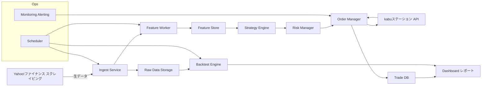
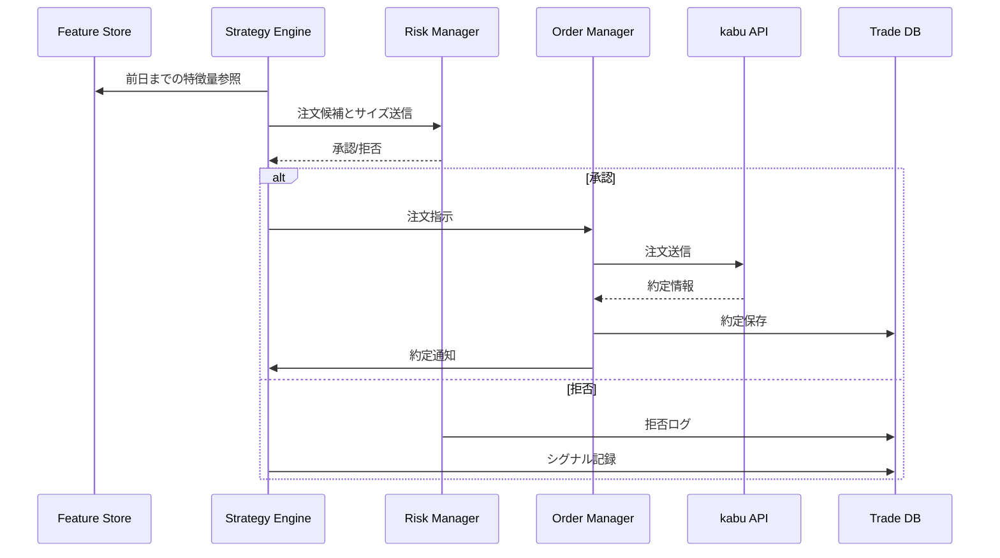
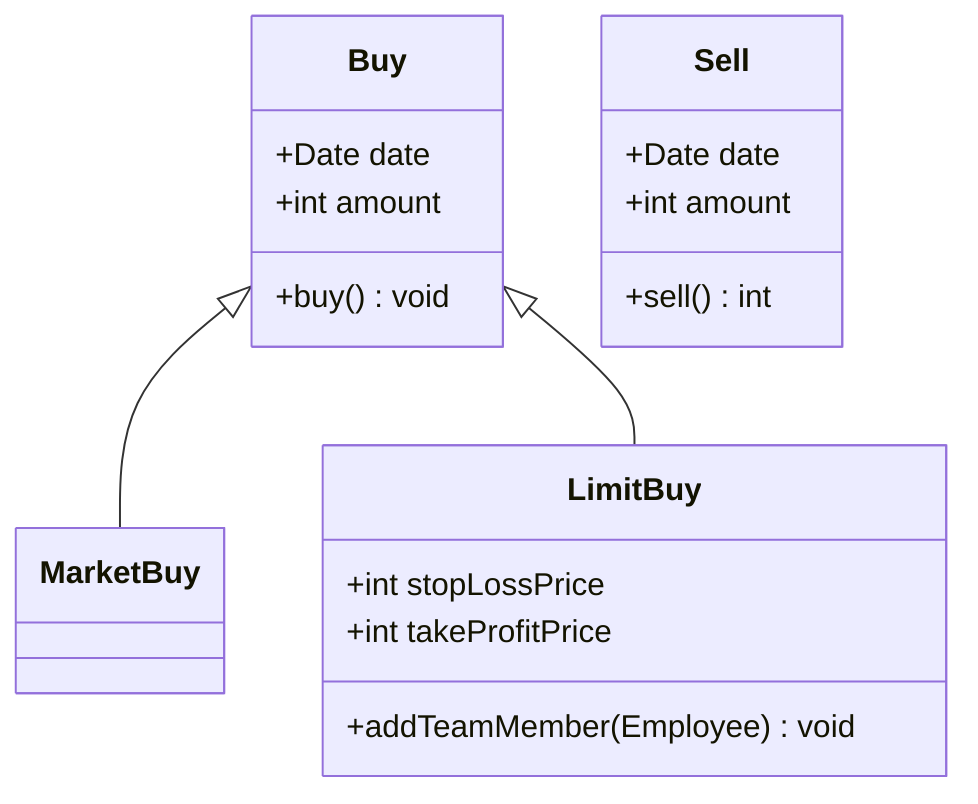

# 基本設計書
## 記法
以下を参照してください。 
- マークダウン（.md）記法、Mermaid記法 
  https://help.docbase.io/posts/13697
- plantUML記法 
  https://help.docbase.io/posts/3720083
## 目次
#### 1. システム概要（System Overview）
- 目的
- ユースケース
- 全体アーキテクチャ（Mermaid の flowchart or sequenceDiagram） 
  ⇒ここが“全体の地図”になる。
#### 2. 機能一覧（Functional Specification）
- 機能の箇条書き
- それぞれの入出力 
  ⇒状態遷移があるなら Mermaid の stateDiagram→ 個人開発でも必須。後で迷わなくなる。
#### 3. ユースケース定義（Use Case Definition）
- アクター
- シナリオ
- 例外パターン 
  ⇒Mermaid の sequenceDiagram が最強に役立つ
#### 4. 画面仕様（UI Specification）
- 画面構成
- 入力項目
- 遷移図（Mermaid の flowchart） 
  ⇒Web/アプリなら必須。CLI なら不要。
#### 5. データベース設計（DB Design）
- ER 図（Mermaid の erDiagram）
- テーブル定義
- インデックス方針
- データフロー（DFD）
#### 6. API / モジュール設計（Interface Design）
- API 仕様（REST/GraphQL）
- リクエスト・レスポンス
- エラーコード 
  ⇒Mermaid の sequenceDiagram で通信フローを書くと強い
#### 7. 処理フロー設計（Logic / Algorithm Design）
- 売買判定ロジック
- バッチ処理
- 常時稼働プロセス 
  ⇒Mermaid の flowchart で可視化 → 最重要。
#### 8. 非機能要件（Non-functional Requirements）
- パフォーマンス
- セキュリティ
- ログ
- 監視
- 運用フロー 
  ⇒個人開発でも“運用で死なないため”に必要。
#### 9. テスト設計（Test Plan）
- 単体テスト項目
- 結合テスト項目
- シナリオテスト
- 例外系テスト 
  ⇒後でバグ地獄にならないための保険。
#### 10. 運用設計（Operation Design）
- バッチの実行タイミング
- 障害時のリカバリ
- ログの保管
- デプロイ手順 
  ⇒個人開発でも“動かし続ける”ために重要。
## 1. システム概要（System Overview）
### 目的 
  本システムの目的は、ニュース、出来高、テクニカル指標、財務指標など複数の市場データを統合し、
  データ駆動型の売買判断ロジックを自動的に生成・適用するスイングトレード運用基盤を構築することである。
  本システムは、データ取得、特徴量生成、売買判定、注文実行、ポジション管理を一貫して自動化し、
  人間の主観や感情に依存しない 再現性の高いトレードプロセス を実現し、
  リスク一定方式による資金管理と、パターン別の売買戦略を組み合わせることで
  安定した期待値を持つ運用ロジックを継続的に実行可能な状態に保つ ことを目的とする。
  また、kabuステーション® API を利用した自動発注機能、
  バックテスト・テスト売買機能、ログ・分析機能を備えることで、
  ロジックの検証・改善・運用を継続的に行える技術的基盤を提供する。
### ユースケース 
本節では本システムで想定する主要なユースケースを列挙する。各ユースケースはアクター・トリガー・前提条件・主要フロー・事後条件を簡潔に示す。
#### UC01 データ取得
アクター: データ取得バッチ（自動）
トリガー: 定期スケジュールまたは外部イベント（ニュース更新）
前提条件: 各データソースのAPIキー・接続設定が有効
主要フロー: ニュース API、マーケットデータ、出来高、財務データを取得 → 生データを時刻付きでデータレイクに保存 → 取得ログを記録
事後条件: 生データが永続化され、次段階で利用可能
#### UC02 特徴量生成
アクター: 特徴量生成ワーカー
トリガー: データ取得完了または定期バッチ
前提条件: 生データがデータレイクに存在
主要フロー: 時系列指標（移動平均、RSI、MACD、ROC、ボリンジャー等）を計算 → ニュースのスコアリング（偏差値化） → 特徴量テーブルに保存
事後条件: モデル/ルールが参照可能な特徴量セットが作成される
#### UC03 バックテスト
アクター: 運用担当者（手動） / バックテストジョブ（自動）
トリガー: 新ルール追加、パラメータ変更、定期検証
前提条件: 過去データと特徴量が揃っていること
主要フロー: ルールをインポート → インサンプル／アウトオブサンプルで検証 → スリッページ・手数料を考慮した結果を出力 → 成績レポート生成
事後条件: 検証結果が保存され、運用判断に利用可能
#### UC04 テスト売買（ペーパートレード）
アクター: テスト売買エンジン
トリガー: テストモードでの運用開始
前提条件: 初期資金設定、ルール適用済み
主要フロー: 売買シグナルに基づき仮想注文を発行 → 約定シミュレーション（板情報・スリッページを模擬） → PnL・ドローダウンを記録
事後条件: テスト結果が分析ダッシュボードに反映される
#### UC05 本番自動売買
アクター: オーダーマネージャー、kabuステーション API
トリガー: 売買判定が成立し、運用ルールが許可している場合
前提条件: API接続正常、資金・ポジション制約クリア
主要フロー: 注文生成 → 注文送信 → 約定確認 → ポジション管理（分割利確・損切り監視） → 取引ログ保存
事後条件: 実取引が完了し、監査ログが残る
#### UC06 監視とアラート
アクター: 監視サービス、運用担当者
トリガー: APIエラー、注文失敗、想定外のドローダウン、システム停止
前提条件: 監視ルールが設定済み
主要フロー: メトリクス収集 → 閾値超過でアラート発報（メール/Slack等） → 運用担当者が対応
事後条件: インシデントが記録され、復旧手順が開始される
#### UC07 運用管理
アクター: 運用担当者
トリガー: ルール追加・パラメータ変更・資金変更
前提条件: 認可された管理者権限
主要フロー: ルールの登録・バージョン管理 → テスト売買で検証 → 本番反映（ロールアウト）
事後条件: 変更履歴が保存され、ロールバック可能
### 全体アーキテクチャ（Mermaid の flowchart or sequenceDiagram）
#### アーキテクチャ図

#### 取引シーケンス

## 2. 機能一覧（Functional Specification）
| **機能ID** | **機能名** | **概要** | **入力** | **出力** |
| --- | --- | --- | --- | --- |
| F-01 | 市場データスクレイピング | Yahoo!ファイナンスから株価・出来高・指数を取得するバッチ処理 | 銘柄コード; スクレイピング対象URL; 実行スケジュール | 生株価データ（時系列）; 取得ログ |
| F-02 | 財務データスクレイピング | Yahoo!ファイナンスから決算・財務指標を取得する | 銘柄コード; 財務ページURL | 財務データ（年度/四半期）; 財務指標テーブル; 取得ログ |
| F-03 | ニュースデータ収集 | 銘柄関連ニュースの取得とメタ情報抽出 | 銘柄コード; ニュース検索URL | ニュースタイトル; 本文; 日付; ソース |
| F-04 | スクレイピング制御 | レート制御・キャッシュ・リトライ・IP管理を行う共通モジュール | スクレイピング要求; ポリシー設定 | 実行許可/待機指示; ログ |
| F-05 | Ingest Service | 生データの正規化・タイムスタンプ付与・Raw保存を行う | 生データ（HTML/JSON）; メタ情報 | 正規化データ; Raw Data Storageエントリ |
| F-06 | Raw Data Storage | 生データを時系列で永続化するストレージ | 正規化データ; 取得メタ | 永続化レコード; 監査ログ |
| F-07 | テクニカル指標生成 | 前日基準でMA/RSI/MACD/ROC/ボリンジャー等を計算する | 生株価データ（時系列） | テクニカル指標; 特徴量レコード |
| F-08 | ニューススコアリング | ニュースをスコア化し偏差値化して特徴量化する | ニュース本文; 過去スコア分布 | ニューススコア（偏差値）; 特徴量 |
| F-09 | 財務指標整形 | 財務データから指標（PER/PBR/ROE等）を算出・整形する | 財務データ（年度/四半期） | 財務指標テーブル; 特徴量 |
| F-10 | 特徴量統合・保存 | テクニカル・財務・ニュースを統合してFeature Storeへ保存 | テクニカル指標; 財務指標; ニューススコア | 統合特徴量セット; バージョン情報 |
| F-11 | 特徴量バージョン管理 | 特徴量セットのバージョン管理とメタ保存を行う | 特徴量セット; 実行コンテキスト | バージョンID; メタログ |
| F-12 | 売買シグナル生成（Strategy Engine） | ルール／パターンに基づき売買シグナルと推奨サイズを生成する | 特徴量セット; 売買ルールパラメータ | 売買シグナル; 推奨ポジションサイズ; シグナルログ |
| F-13 | リスク管理（Risk Manager） | 注文前に資金・ポジション・セクター等の制約をチェックする | 売買シグナル; 現在ポジション; 資金情報; リスクルール | 承認/拒否; 拒否理由 |
| F-14 | 注文生成（Order Manager） | 承認済シグナルからkabu API向け注文データを生成する | 承認済シグナル; 注文パラメータ | 注文リクエスト; 注文ログ |
| F-15 | 注文送信・約定確認 | kabuステーション API へ注文送信し約定を確認する | 注文リクエスト | 約定情報; 失敗時リトライログ; ポジション更新 |
| F-16 | ポジション管理 | 保有ポジションの利確・損切り・分割利確を管理する | 約定情報; ポジションルール | ポジション状態; 注文指示 |
| F-17 | バックテストエンジン | 過去データで戦略を検証し成績を出力する | 過去特徴量; 過去株価; 売買ルール | 損益曲線; 勝率/PF/DD等の指標; レポート |
| F-18 | ペーパートレード（Simulator） | 実注文なしで約定シミュレーションを行う | 売買シグナル; 市場データ（リアルタイム/過去） | 仮想約定結果; PnL/ドローダウン |
| F-19 | 監視・アラート | システム異常や運用閾値超過を検知して通知する | メトリクス; 閾値設定 | アラート通知（Slack/メール）; インシデントログ |
| F-20 | ダッシュボード表示 | 運用状況・成績・ポジションを可視化するUI | Trade DB; Feature Store; シグナルログ | Webダッシュボード; 日次レポート |
| F-21 | ログ・監査管理 | 取得データ・特徴量・ルール・取引ログを監査用に保存する | 生データ; 特徴量; ルールバージョン; 取引ログ | 監査レコード; 検索可能ログ |
| F-22 | スケジューラ | データ収集・特徴量更新・戦略評価・バックテストを定期実行する | ジョブ定義; スケジュール設定 | ジョブ実行トリガー; 実行ログ |
| F-23 | 設定管理・権限 | ルール・パラメータ・運用者権限を管理する | 管理者操作; 設定データ | 設定反映; 変更履歴 |
| F-24 | フェイルセーフ・リカバリ | API障害・二重注文防止・リトライ・ロールバックを管理する | 障害イベント; トランザクション情報 | 復旧アクション; 障害ログ |

## クラス構成

## 3. ユースケース定義（Use Case Definition）
- アクター
- シナリオ
- 例外パターン
## 4. 画面仕様（UI Specification）
- 画面構成
- 入力項目
- 遷移図（Mermaid の flowchart）
## 5. データベース設計（DB Design）
- ER 図（Mermaid の erDiagram）
- テーブル定義
- インデックス方針
- データフロー（DFD）
## 6. API / モジュール設計（Interface Design）
- API 仕様（REST/GraphQL）
- リクエスト・レスポンス
- エラーコード
## 7. 処理フロー設計（Logic / Algorithm Design）
- 売買判定ロジック
- バッチ処理
- 常時稼働プロセス
## 8. 非機能要件（Non-functional Requirements）
- パフォーマンス
- セキュリティ
- ログ
- 監視
- 運用フロー
## 9. テスト設計（Test Plan）
- 単体テスト項目
- 結合テスト項目
- シナリオテスト
- 例外系テスト
## 10. 運用設計（Operation Design）
- バッチ処理と常駐処理の流れ（実行タイミング）
- 障害時のリカバリ
- ログの保管
- デプロイ手順

