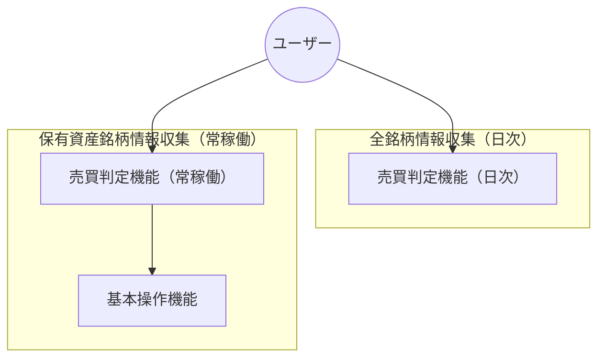
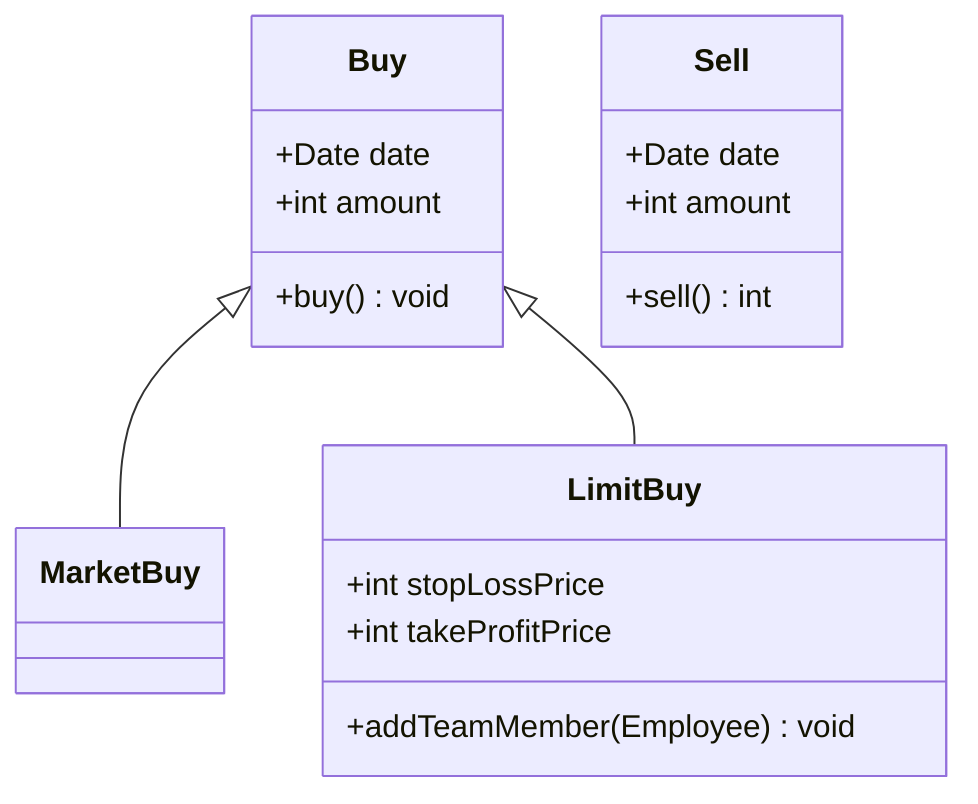

# 基本設計書
## 記法
以下を参照してください。 
- マークダウン（.md）記法、Mermaid記法 
  https://help.docbase.io/posts/13697
- plantUML記法 
  https://help.docbase.io/posts/3720083
## 目次
### 1. システム概要（System Overview）
- 目的
- ユースケース
- 全体アーキテクチャ（Mermaid の flowchart or sequenceDiagram） 
  ⇒ここが“全体の地図”になる。
### 2. 機能一覧（Functional Specification）
- 機能の箇条書き
- それぞれの入出力 
  ⇒状態遷移があるなら Mermaid の stateDiagram→ 個人開発でも必須。後で迷わなくなる。
### 3. ユースケース定義（Use Case Definition）
- アクター
- シナリオ
- 例外パターン 
  ⇒Mermaid の sequenceDiagram が最強に役立つ
### 4. 画面仕様（UI Specification）※必要なら
- 画面構成
- 入力項目
- 遷移図（Mermaid の flowchart） 
  ⇒Web/アプリなら必須。CLI なら不要。
### 5. データベース設計（DB Design）
- ER 図（Mermaid の erDiagram）
- テーブル定義
- インデックス方針
- データフロー（DFD）。
### 6. API / モジュール設計（Interface Design）
- API 仕様（REST/GraphQL）
- リクエスト・レスポンス
- エラーコード 
  ⇒Mermaid の sequenceDiagram で通信フローを書くと強い
### 7. 処理フロー設計（Logic / Algorithm Design）
- 売買判定ロジック
- バッチ処理
- 常時稼働プロセス 
  ⇒Mermaid の flowchart で可視化 → 最重要。
### 8. 非機能要件（Non-functional Requirements）
- パフォーマンス
- セキュリティ
- ログ
- 監視
- 運用フロー 
  ⇒個人開発でも“運用で死なないため”に必要。
### 9. テスト設計（Test Plan）
- 単体テスト項目
- 結合テスト項目
- シナリオテスト
- 例外系テスト 
  ⇒後でバグ地獄にならないための保険。
### 10. 運用設計（Operation Design）
- バッチの実行タイミング
- 障害時のリカバリ
- ログの保管
- デプロイ手順 
  ⇒個人開発でも“動かし続ける”ために重要。
## 機能一覧
### 作成する機能
- 全銘柄情報収集（日次）
  - 売買判定機能（日次）
- 保有資産銘柄情報収集（常稼働）
  - 基本操作機能
    - 成行注文機能
    - 指値注文機能
    - 指値注文取消機能
    - 売却注文機能
  - 売買判定機能（常稼働）
## 全体構成図（API → 判定ロジック → 注文 → DB → ログ）

## クラス構成

## モジュール構成
 TBD
## データフロー図（DFD）
TBD
## バッチ処理と常駐処理の流れ
TBD
## 外部APIとの通信方式（REST / WebSocket）
TBD
## 外部APIとの通信方式（REST / WebSocket）
TBD
