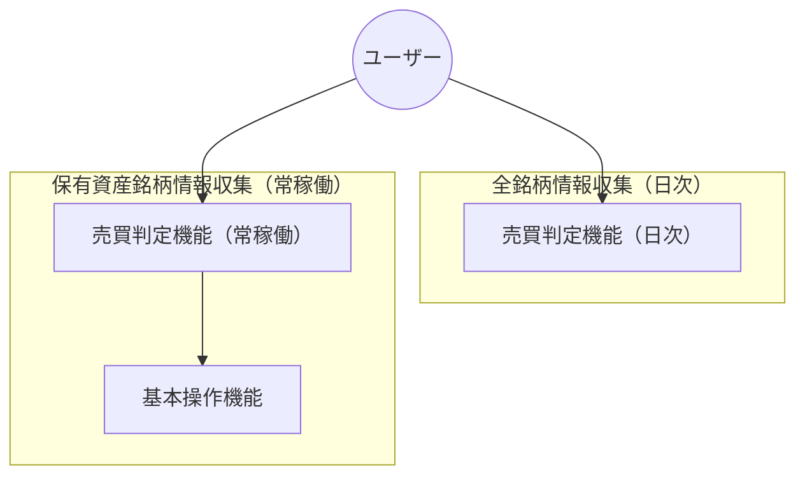

# 基本設計書
## 記法
以下を参照してください。 
- マークダウン（.md）記法、Mermaid記法 
  https://help.docbase.io/posts/13697
- plantUML記法 
  https://help.docbase.io/posts/3720083
## 機能一覧
### 作成する機能
- 全銘柄情報収集（日次）
  - 売買判定機能（日次）
- 保有資産銘柄情報収集（常稼働）
  - 基本操作機能
    - 成行注文機能
    - 指値注文機能
    - 指値注文取消機能
    - 売却注文機能
  - 売買判定機能（常稼働）
## 全体構成図（API → 判定ロジック → 注文 → DB → ログ）

## モジュール構成
TBD
## データフロー図（DFD）
TBD
## バッチ処理と常駐処理の流れ
TBD
## 外部APIとの通信方式（REST / WebSocket）
TBD
## 外部APIとの通信方式（REST / WebSocket）
TBD
