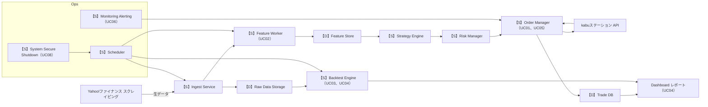
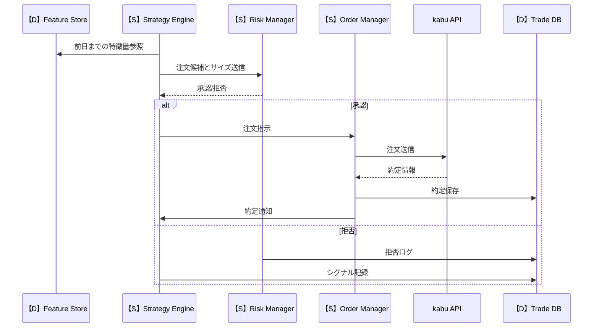
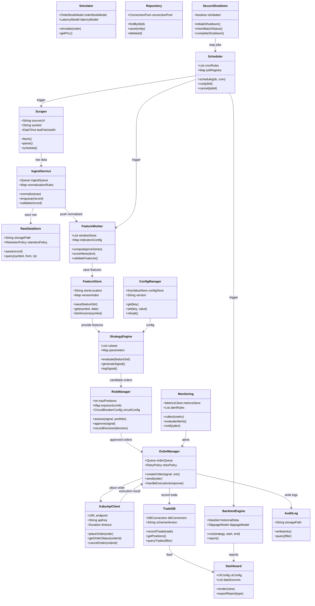
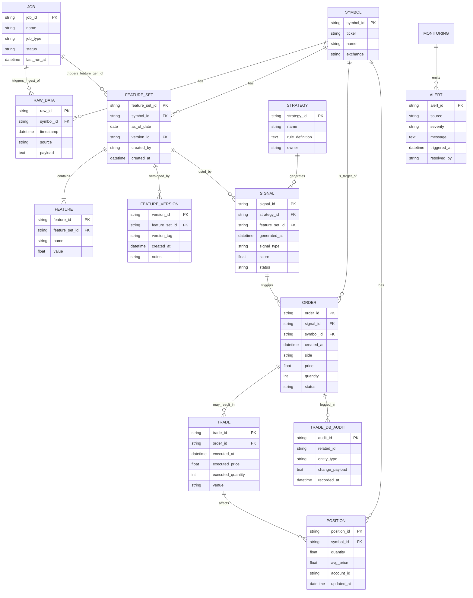
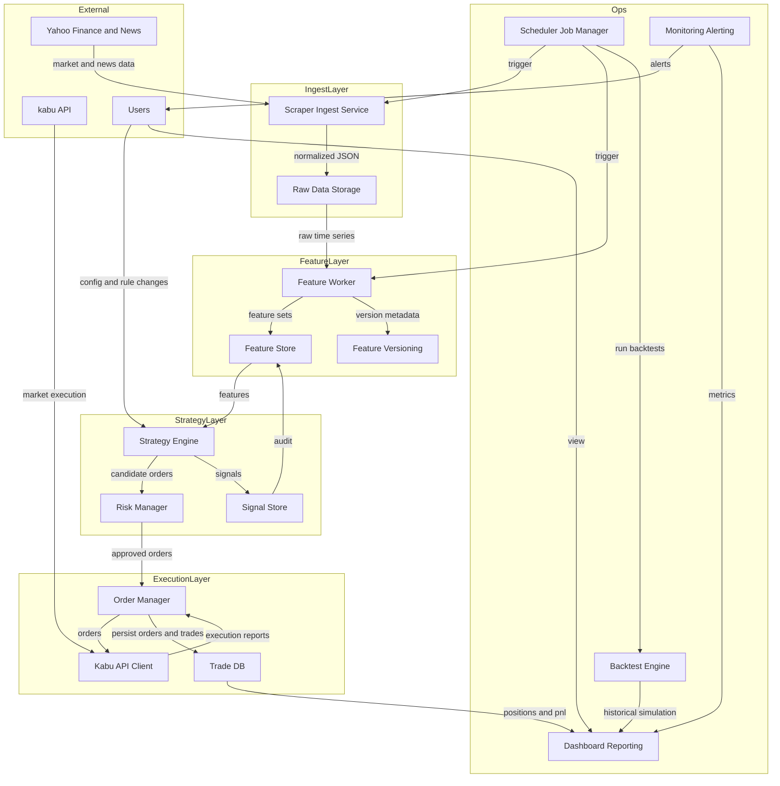

# 基本設計書
## 記法
以下を参照してください。<br>
- マークダウン（.md）記法、Mermaid記法<br>
  https://help.docbase.io/posts/13697
- plantUML記法<br>
  https://help.docbase.io/posts/3720083

<details><summary style="cursor:pointer">目次👇</summary>

#### 1. システム概要（System Overview）
- 目的
- ユースケース
- 全体アーキテクチャ（Mermaid の flowchart or sequenceDiagram）<br>
  ⇒ここが“全体の地図”になる。
#### 2. 機能一覧（Functional Specification）
- 機能一覧
#### 3. クラス構成図（Class Diagram）
- クラス構成図
#### 4. 画面仕様（UI Specification）
- 画面構成
- 入力項目
- 遷移図（Mermaid の flowchart）<br>
  ⇒Web/アプリなら必須。CLI なら不要。
#### 5. データベース設計（DB Design）
- ER 図（Mermaid の erDiagram）
- テーブル定義
- インデックス方針
- データフロー（DFD）
#### 6. API / モジュール設計（Interface Design）
- API 仕様（REST/GraphQL）
- リクエスト・レスポンス
- エラーコード<br>
  ⇒Mermaid の sequenceDiagram で通信フローを書くと強い
#### 7. 処理フロー設計（Logic / Algorithm Design）
- 売買判定ロジック
- バッチ処理
- 常時稼働プロセス<br>
  ⇒Mermaid の flowchart で可視化 → 最重要。
#### 8. 非機能要件（Non-functional Requirements）
- パフォーマンス
- セキュリティ
- ログ
- 監視
- 運用フロー<br>
  ⇒個人開発でも“運用で死なないため”に必要。
#### 9. テスト設計（Test Plan）
- 単体テスト項目
- 結合テスト項目
- シナリオテスト
- 例外系テスト<br>
  ⇒後でバグ地獄にならないための保険。
#### 10. 運用設計（Operation Design）
- バッチの実行タイミング
- 障害時のリカバリ
- ログの保管
- デプロイ手順<br>
  ⇒個人開発でも“動かし続ける”ために重要。

</details>

## 1. システム概要（System Overview）
### 目的<br>
  本システムの目的は、ニュース、出来高、テクニカル指標、財務指標など複数の市場データを統合し、
  データ駆動型の売買判断ロジックを自動的に生成・適用するスイングトレード運用基盤を構築することである。
  本システムは、データ取得、特徴量生成、売買判定、注文実行、ポジション管理を一貫して自動化し、
  人間の主観や感情に依存しない 再現性の高いトレードプロセス を実現し、
  リスク一定方式による資金管理と、パターン別の売買戦略を組み合わせることで
  安定した期待値を持つ運用ロジックを継続的に実行可能な状態に保つ ことを目的とする。
  また、kabuステーション® API を利用した自動発注機能、
  バックテスト・テスト売買機能、ログ・分析機能を備えることで、
  ロジックの検証・改善・運用を継続的に行える技術的基盤を提供する。
### ユースケース<br>
本節では本システムで想定する主要なユースケースを列挙する。各ユースケースはアクター・トリガー・前提条件・主要フロー・事後条件を簡潔に示す。
#### UC01 データ取得
アクター: データ取得バッチ（自動）
トリガー: 定期スケジュールまたは外部イベント（ニュース更新）
前提条件: 各データソースのAPIキー・接続設定が有効
主要フロー: ニュース API、マーケットデータ、出来高、財務データを取得 → 生データを時刻付きでデータレイクに保存 → 取得ログを記録
事後条件: 生データが永続化され、次段階で利用可能
#### UC02 特徴量生成
アクター: 特徴量生成ワーカー<br>
トリガー: データ取得完了または定期バッチ<br>
前提条件: 生データがデータレイクに存在<br>
主要フロー: 時系列指標（移動平均、RSI、MACD、ROC、ボリンジャー等）を計算 → ニュースのスコアリング（偏差値化） → 特徴量テーブルに保存<br>
事後条件: モデル/ルールが参照可能な特徴量セットが作成される<br>
#### UC03 バックテスト
アクター: 運用担当者（手動） / バックテストジョブ（自動）<br>
トリガー: 新ルール追加、パラメータ変更、定期検証<br>
前提条件: 過去データと特徴量が揃っていること<br>
主要フロー: ルールをインポート → インサンプル／アウトオブサンプルで検証 → スリッページ・手数料を考慮した結果を出力 → 成績レポート生成<br>
事後条件: 検証結果が保存され、運用判断に利用可能<br>
#### UC04 テスト売買（ペーパートレード）
アクター: テスト売買エンジン<br>
トリガー: テストモードでの運用開始<br>
前提条件: 初期資金設定、ルール適用済み<br>
主要フロー: 売買シグナルに基づき仮想注文を発行 → 約定シミュレーション（板情報・スリッページを模擬） → PnL・ドローダウンを記録<br>
事後条件: テスト結果が分析ダッシュボードに反映される<br>
#### UC05 本番自動売買
アクター: オーダーマネージャー、kabuステーション API<br>
トリガー: 売買判定が成立し、運用ルールが許可している場合<br>
前提条件: API接続正常、資金・ポジション制約クリア<br>
主要フロー: 注文生成 → 注文送信 → 約定確認 → ポジション管理（分割利確・損切り監視） → 取引ログ保存<br>
事後条件: 実取引が完了し、監査ログが残る<br>
#### UC06 監視とアラート
アクター: 監視サービス、運用担当者<br>
トリガー: APIエラー、注文失敗、想定外のドローダウン、システム停止<br>
前提条件: 監視ルールが設定済み<br>
主要フロー: メトリクス収集 → 閾値超過でアラート発報（メール/Slack等） → 運用担当者が対応<br>
事後条件: インシデントが記録され、復旧手順が開始される<br>
#### UC07 運用管理
アクター: 運用担当者<br>
トリガー: ルール追加・パラメータ変更・資金変更<br>
前提条件: 認可された管理者権限<br>
主要フロー: ルールの登録・バージョン管理 → テスト売買で検証 → 本番反映（ロールアウト）<br>
事後条件: 変更履歴が保存され、ロールバック可能<br>

#### UC08 システム安全停止
アクター：開発者
トリガー：ルール追加・パラメータ変更・資金変更<br>
前提条件: 認可された管理者権限<br>
主要フロー: 停止処理実施 → 稼働中バッチ処理ステータスを確認 → 全バッチ処理の停止後にシステム全体を安全停止<br>
事後条件: システム停止のログ出力<br>

### 全体アーキテクチャ（Mermaid の flowchart or sequenceDiagram）
※【S】...サービス、【D】...データ
#### アーキテクチャ図

#### 取引シーケンス

## 2. 機能一覧（Functional Specification）
| **機能ID** | **機能名** | **概要** | **入力** | **出力** | **実装先** |
| --- | --- | --- | --- | --- | --- |
| F-01 | 市場データスクレイピング | Yahoo!ファイナンスから株価・出来高・指数を取得するバッチ処理 | 銘柄コード; スクレイピング対象URL; 実行スケジュール | 生株価データ（時系列）; 取得ログ | 【S】Ingest Service |
| F-02 | 財務データスクレイピング | Yahoo!ファイナンスから決算・財務指標を取得する | 銘柄コード; 財務ページURL | 財務データ（年度/四半期）; 財務指標テーブル; 取得ログ | 【S】Ingest Service |
| F-03 | ニュースデータ収集 | 銘柄関連ニュースの取得とメタ情報抽出 | 銘柄コード; ニュース検索URL | ニュースタイトル; 本文; 日付; ソース | 【S】Ingest Service |
| F-04 | スクレイピング制御 | レート制御・キャッシュ・リトライ・IP管理を行う共通モジュール | スクレイピング要求; ポリシー設定 | 実行許可/待機指示; ログ | 【S】Ingest Service |
| F-05 | Ingest Service | 生データの正規化・タイムスタンプ付与・Raw保存を行う | 生データ（HTML/JSON）; メタ情報 | 正規化データ; Raw Data Storageエントリ | 【S】Ingest Service |
| F-06 | Raw Data Storage | 生データを時系列で永続化するストレージ | 正規化データ; 取得メタ | 永続化レコード; 監査ログ | 【D】Raw Data Storage |
| F-07 | テクニカル指標生成 | 前日基準でMA/RSI/MACD/ROC/ボリンジャー等を計算する | 生株価データ（時系列） | テクニカル指標; 特徴量レコード | 【S】Feature Worker（UC02） |
| F-08 | ニューススコアリング | ニュースをスコア化し偏差値化して特徴量化する | ニュース本文; 過去スコア分布 | ニューススコア（偏差値）; 特徴量 | 【S】Feature Worker（UC02） |
| F-09 | 財務指標整形 | 財務データから指標（PER/PBR/ROE等）を算出・整形する | 財務データ（年度/四半期） | 財務指標テーブル; 特徴量 | 【S】Feature Worker（UC02）|
| F-10 | 特徴量統合・保存 | テクニカル・財務・ニュースを統合してFeature Storeへ保存 | テクニカル指標; 財務指標; ニューススコア | 統合特徴量セット; バージョン情報 | 【S】Feature Worker（UC02）|
| F-11 | 特徴量バージョン管理 | 特徴量セットのバージョン管理とメタ保存を行う | 特徴量セット; 実行コンテキスト | バージョンID; メタログ | 【D】Feature Store |
| F-12 | 売買シグナル生成（Strategy Engine） | ルール／パターンに基づき売買シグナルと推奨サイズを生成する | 特徴量セット; 売買ルールパラメータ | 売買シグナル; 推奨ポジションサイズ; シグナルログ | 【S】Strategy Engine |
| F-13 | リスク管理（Risk Manager） | 注文前に資金・ポジション・セクター等の制約をチェックする | 売買シグナル; 現在ポジション; 資金情報; リスクルール | 承認/拒否; 拒否理由 | 【S】Risk Manager |
| F-14 | 注文生成（Order Manager） | 承認済シグナルからkabu API向け注文データを生成する | 承認済シグナル; 注文パラメータ | 注文リクエスト; 注文ログ | 【S】Order Manager（UC01、UC05） |
| F-15 | 注文送信・約定確認 | kabuステーション API へ注文送信し約定を確認する | 注文リクエスト | 約定情報; 失敗時リトライログ; ポジション更新 | 【S】Order Manager（UC01、UC05） |
| F-16 | ポジション管理 | 保有ポジションの利確・損切り・分割利確を管理する | 約定情報; ポジションルール | ポジション状態; 注文指示 | 【D】Trade DB |
| F-17 | バックテストエンジン | 過去データで戦略を検証し成績を出力する | 過去特徴量; 過去株価; 売買ルール | 損益曲線; 勝率/PF/DD等の指標; レポート | 【S】Backtest Engine（UC03、UC04） |
| F-18 | ペーパートレード（Simulator） | 実注文なしで約定シミュレーションを行う | 売買シグナル; 市場データ（リアルタイム/過去） | 仮想約定結果; PnL/ドローダウン | 【S】Backtest Engine（UC03、UC04）、【S】Order Manager（UC01、UC05） |
| F-19 | 監視・アラート | システム異常や運用閾値超過を検知して通知する | メトリクス; 閾値設定 | アラート通知（Slack/メール）; インシデントログ | 【S】Monitoring Alerting（UC06） |
| F-20 | ダッシュボード表示 | 運用状況・成績・ポジションを可視化するUI | Trade DB; Feature Store; シグナルログ | Webダッシュボード; 日次レポート | Dashboard レポート（UC04） |
| F-21 | ログ・監査管理 | 取得データ・特徴量・ルール・取引ログを監査用に保存する | 生データ; 特徴量; ルールバージョン; 取引ログ | 監査レコード; 検索可能ログ |　【S】Order Manager（UC01、UC05）、【D】Trade DB |
| F-22 | スケジューラ | データ収集・特徴量更新・戦略評価・バックテストを定期実行する | ジョブ定義; スケジュール設定 | ジョブ実行トリガー; 実行ログ | 【S】Scheduler |
| F-23 | 設定管理・権限 | ルール・パラメータ・運用者権限を管理する | 管理者操作; 設定データ | 設定反映; 変更履歴 | **TBD** |
| F-24 | フェイルセーフ・リカバリ | API障害・二重注文防止・リトライ・ロールバックを管理する | 障害イベント; トランザクション情報 | 復旧アクション; 障害ログ | **TBD** |

## 3. クラス構成図（Class Diagram）

## 4. 画面仕様（UI Specification）
- 画面構成
- 入力項目
- 遷移図（Mermaid の flowchart）
## 5. データベース設計（DB Design）
- ER 図（Mermaid の erDiagram）

- テーブル定義
``` sql

-- 拡張
CREATE EXTENSION IF NOT EXISTS "pgcrypto";

-- SYMBOL: 銘柄マスタ
CREATE TABLE symbol (
  symbol_id       VARCHAR(64) PRIMARY KEY,
  ticker          VARCHAR(32) NOT NULL,
  name            TEXT,
  exchange        VARCHAR(64),
  created_at      TIMESTAMP WITH TIME ZONE DEFAULT now(),
  updated_at      TIMESTAMP WITH TIME ZONE DEFAULT now()
);

CREATE INDEX IF NOT EXISTS idx_symbol_ticker ON symbol(ticker);

-- RAW_DATA: 生データ（パーティション：日付）
CREATE TABLE raw_data (
  raw_id          UUID PRIMARY KEY DEFAULT gen_random_uuid(),
  symbol_id       VARCHAR(64) NOT NULL,
  ts              TIMESTAMP WITH TIME ZONE NOT NULL,
  source          VARCHAR(128),
  payload         JSONB,
  created_at      TIMESTAMP WITH TIME ZONE DEFAULT now()
) PARTITION BY RANGE (ts);

-- 例：月次パーティション作成（運用時にスクリプトで作成）
CREATE TABLE raw_data_202605 PARTITION OF raw_data FOR VALUES FROM ('2026-05-01') TO ('2026-06-01');

ALTER TABLE raw_data
  ADD CONSTRAINT fk_raw_symbol FOREIGN KEY(symbol_id) REFERENCES symbol(symbol_id) ON DELETE CASCADE;

CREATE INDEX IF NOT EXISTS idx_raw_symbol_ts ON raw_data(symbol_id, ts);
CREATE INDEX IF NOT EXISTS idx_raw_ts ON raw_data(ts);

-- FEATURE_SET: 特徴量セット（銘柄×日付×バージョン）
CREATE TABLE feature_set (
  feature_set_id  UUID PRIMARY KEY DEFAULT gen_random_uuid(),
  symbol_id       VARCHAR(64) NOT NULL,
  as_of_date      DATE NOT NULL,
  version_id      UUID,
  created_by      VARCHAR(128),
  created_at      TIMESTAMP WITH TIME ZONE DEFAULT now(),
  CONSTRAINT uq_feature_set_symbol_date UNIQUE(symbol_id, as_of_date, version_id)
);

ALTER TABLE feature_set
  ADD CONSTRAINT fk_feature_set_symbol FOREIGN KEY(symbol_id) REFERENCES symbol(symbol_id) ON DELETE CASCADE;

CREATE INDEX IF NOT EXISTS idx_feature_set_symbol_date ON feature_set(symbol_id, as_of_date);

-- FEATURE: 個々の特徴量
CREATE TABLE feature (
  feature_id      UUID PRIMARY KEY DEFAULT gen_random_uuid(),
  feature_set_id  UUID NOT NULL,
  name            VARCHAR(128) NOT NULL,
  value           DOUBLE PRECISION,
  meta            JSONB,
  created_at      TIMESTAMP WITH TIME ZONE DEFAULT now()
);

ALTER TABLE feature
  ADD CONSTRAINT fk_feature_set FOREIGN KEY(feature_set_id) REFERENCES feature_set(feature_set_id) ON DELETE CASCADE;

CREATE INDEX IF NOT EXISTS idx_feature_set_name ON feature(feature_set_id, name);

-- FEATURE_VERSION: バージョン管理
CREATE TABLE feature_version (
  version_id      UUID PRIMARY KEY DEFAULT gen_random_uuid(),
  feature_set_id  UUID,
  version_tag     VARCHAR(128),
  created_at      TIMESTAMP WITH TIME ZONE DEFAULT now(),
  notes           TEXT
);

ALTER TABLE feature_version
  ADD CONSTRAINT fk_feature_version_set FOREIGN KEY(feature_set_id) REFERENCES feature_set(feature_set_id) ON DELETE SET NULL;

CREATE INDEX IF NOT EXISTS idx_feature_version_tag ON feature_version(version_tag);

-- STRATEGY: ルール定義
CREATE TABLE strategy (
  strategy_id     UUID PRIMARY KEY DEFAULT gen_random_uuid(),
  name            VARCHAR(256) NOT NULL,
  rule_definition JSONB,
  owner           VARCHAR(128),
  created_at      TIMESTAMP WITH TIME ZONE DEFAULT now(),
  updated_at      TIMESTAMP WITH TIME ZONE DEFAULT now()
);

CREATE INDEX IF NOT EXISTS idx_strategy_name ON strategy(name);

-- SIGNAL: 生成されたシグナル
CREATE TABLE signal (
  signal_id       UUID PRIMARY KEY DEFAULT gen_random_uuid(),
  strategy_id     UUID NOT NULL,
  feature_set_id  UUID,
  generated_at    TIMESTAMP WITH TIME ZONE NOT NULL DEFAULT now(),
  signal_type     VARCHAR(32),
  score           DOUBLE PRECISION,
  status          VARCHAR(32) DEFAULT 'NEW',
  metadata        JSONB,
  created_at      TIMESTAMP WITH TIME ZONE DEFAULT now()
);

ALTER TABLE signal
  ADD CONSTRAINT fk_signal_strategy FOREIGN KEY(strategy_id) REFERENCES strategy(strategy_id) ON DELETE CASCADE,
  ADD CONSTRAINT fk_signal_feature_set FOREIGN KEY(feature_set_id) REFERENCES feature_set(feature_set_id) ON DELETE SET NULL;

CREATE INDEX IF NOT EXISTS idx_signal_strategy_time ON signal(strategy_id, generated_at);
CREATE INDEX IF NOT EXISTS idx_signal_status ON signal(status);

-- trade_order: 注文テーブル（"order"は予約語回避）
CREATE TABLE trade_order (
  order_id        UUID PRIMARY KEY DEFAULT gen_random_uuid(),
  signal_id       UUID,
  symbol_id       VARCHAR(64) NOT NULL,
  created_at      TIMESTAMP WITH TIME ZONE DEFAULT now(),
  side            VARCHAR(8) NOT NULL,
  price           NUMERIC(18,6),
  quantity        BIGINT,
  status          VARCHAR(32) DEFAULT 'PENDING',
  external_order_ref VARCHAR(128),
  metadata        JSONB
);

ALTER TABLE trade_order
  ADD CONSTRAINT fk_order_signal FOREIGN KEY(signal_id) REFERENCES signal(signal_id) ON DELETE SET NULL,
  ADD CONSTRAINT fk_order_symbol FOREIGN KEY(symbol_id) REFERENCES symbol(symbol_id) ON DELETE RESTRICT;

CREATE INDEX IF NOT EXISTS idx_order_symbol_status ON trade_order(symbol_id, status);
CREATE INDEX IF NOT EXISTS idx_order_created_at ON trade_order(created_at);

-- TRADE: 約定情報（パーティション検討）
CREATE TABLE trade (
  trade_id        UUID PRIMARY KEY DEFAULT gen_random_uuid(),
  order_id        UUID NOT NULL,
  executed_at     TIMESTAMP WITH TIME ZONE NOT NULL,
  executed_price  NUMERIC(18,6) NOT NULL,
  executed_quantity BIGINT NOT NULL,
  venue           VARCHAR(128),
  fees            NUMERIC(18,6),
  metadata        JSONB,
  created_at      TIMESTAMP WITH TIME ZONE DEFAULT now()
);

ALTER TABLE trade
  ADD CONSTRAINT fk_trade_order FOREIGN KEY(order_id) REFERENCES trade_order(order_id) ON DELETE CASCADE;

CREATE INDEX IF NOT EXISTS idx_trade_order ON trade(order_id);
CREATE INDEX IF NOT EXISTS idx_trade_executed_at ON trade(executed_at);

-- POSITION: 保有ポジション
CREATE TABLE position (
  position_id     UUID PRIMARY KEY DEFAULT gen_random_uuid(),
  symbol_id       VARCHAR(64) NOT NULL,
  account_id      VARCHAR(128),
  quantity        DOUBLE PRECISION NOT NULL DEFAULT 0,
  avg_price       NUMERIC(18,6),
  updated_at      TIMESTAMP WITH TIME ZONE DEFAULT now(),
  metadata        JSONB
);

ALTER TABLE position
  ADD CONSTRAINT fk_position_symbol FOREIGN KEY(symbol_id) REFERENCES symbol(symbol_id) ON DELETE CASCADE;

CREATE INDEX IF NOT EXISTS idx_position_symbol_account ON position(symbol_id, account_id);

-- TRADE_DB_AUDIT: 監査ログ
CREATE TABLE trade_db_audit (
  audit_id        UUID PRIMARY KEY DEFAULT gen_random_uuid(),
  related_id      UUID,
  entity_type     VARCHAR(64),
  change_payload  JSONB,
  recorded_at     TIMESTAMP WITH TIME ZONE DEFAULT now()
);

CREATE INDEX IF NOT EXISTS idx_audit_related ON trade_db_audit(related_id, entity_type);

-- JOB: ジョブ管理
CREATE TABLE job (
  job_id          UUID PRIMARY KEY DEFAULT gen_random_uuid(),
  name            VARCHAR(256) NOT NULL,
  job_type        VARCHAR(64),
  status          VARCHAR(32),
  last_run_at     TIMESTAMP WITH TIME ZONE,
  schedule        VARCHAR(128),
  metadata        JSONB,
  created_at      TIMESTAMP WITH TIME ZONE DEFAULT now()
);

CREATE INDEX IF NOT EXISTS idx_job_name ON job(name);

-- ALERT: 監視アラート
CREATE TABLE alert (
  alert_id        UUID PRIMARY KEY DEFAULT gen_random_uuid(),
  source          VARCHAR(128),
  severity        VARCHAR(16),
  message         TEXT,
  triggered_at    TIMESTAMP WITH TIME ZONE NOT NULL DEFAULT now(),
  resolved_by     VARCHAR(128),
  resolved_at     TIMESTAMP WITH TIME ZONE,
  metadata        JSONB
);

CREATE INDEX IF NOT EXISTS idx_alert_severity_time ON alert(severity, triggered_at);

```
- インデックス方針

| **テーブル** | **インデックス名** | **目的 / 想定クエリ** | **タイプ** | **備考** |
| --- | --- | --- | --- | --- |
| ``raw_data`` | ``idx_raw_symbol_ts`` | 銘柄×時刻での検索（履歴取得） | B-tree複合 | パーティション併用 |
| ``raw_data`` | ``idx_raw_ts`` | 時系列集計・レンジ検索 | B-tree | パーティションプルーニング有効 |
| ``feature_set`` | ``idx_feature_set_symbol_date`` | 銘柄の日次特徴量取得 | B-tree | 日次バッチ参照が多い |
| ``feature`` | ``idx_feature_set_name`` | 特徴量名での抽出（例：RSI） | B-tree | 小テーブル想定 |
| ``signal`` | ``idx_signal_strategy_time`` | 戦略ごとのシグナル履歴取得 | B-tree複合 | 運用分析用 |
| ``signal`` | ``idx_signal_status`` | 未処理シグナルの抽出 | B-tree | ワークフロー処理用 |
| ``trade_order`` | ``idx_order_symbol_status`` | 注文の状態監視・再送処理 | B-tree複合 | 監視・再試行で頻出 |
| ``trade_order`` | ``idx_order_created_at`` | 時系列ログ抽出 | B-tree | ログ分析用 |
| ``trade`` | ``idx_trade_executed_at`` | 約定時刻レンジ検索 | B-tree | レポート・集計用 |
| ``position`` | ``idx_position_symbol_account`` | アカウント別ポジション参照 | B-tree複合 | リアルタイム参照用 |
| ``trade_db_audit`` | ``idx_audit_related`` | 監査ログ検索 | B-tree複合 | 監査・調査用 |
| 任意 | ``gin_payload_idx`` | payload JSONB のキー検索 | GIN (jsonb_path_ops) | payload内検索が多い場合のみ |

- データフロー（DFD）

## 6. API / モジュール設計（Interface Design）
- API 仕様（REST/GraphQL）
- リクエスト・レスポンス
- エラーコード
## 7. 処理フロー設計（Logic / Algorithm Design）
- 売買判定ロジック
- バッチ処理
- 常時稼働プロセス
## 8. 非機能要件（Non-functional Requirements）
- パフォーマンス
  - SLO/SLA<br>
    内部SLOを 可用性 99.95% / レスポンス P95 ≤ 500ms / バッチ処理完了 ≤ 5分（通常）、顧客向けSLAは 可用性 99.9% を目安とする。
  - スループット<br>
    データ取得ピーク想定 1,000 req/min、特徴量計算バッチ並列度で処理可能とする。負荷試験で P95/P99 を検証。
- セキュリティ
  - 認証・認可<br>
  　個人利用のため無し。
  - データ保護<br>
　　個人利用のため無し。
- ログ
  - 取得項目<br>
　　ログレベル（スクレイピング結果、特徴量バージョン、シグナル、注文リクエスト/応答、監査イベント、エラーの場合エラー内容（警告、業務エラー、システムエラー、出力クラス、出力関数）を必須で記録。
  - 保管期間<br>
　　3年。（本来、監査ログは 最低1年（法令・調査要件に応じ延長）。改ざん防止（WORM/署名）を実装。とかの考慮があるが個人利用なので不要。）
 　
- 監視
  - 監視レベル
　　以下、**TBD**
　　- 実装予定内容
　　　死活（L1）、エラー/例外（L2）、ビジネス指標（L3：DD/PnL閾値）。アラートはSlack/メールで即時通知、重大度別エスカレーションを定義。
  - 運用フロー
  **TBD**

## 9. テスト設計（Test Plan）
以下は本システム向けのテスト設計（自動化前提）です。各項目に代表的なテストケース、受入基準、推奨ツールを明記しています。

### 共通事項
- 環境: dev（単体/結合）、staging（シナリオ/負荷/回帰）、prod（スモーク）
- テストデータ: DBスナップショット、固定シードの時系列データ、ニュースサンプルセットを用意すること。
- 品質ゲート: Unit coverage ≥ 80%（重要モジュールは90%目標）。CIで静的解析・型チェック・依存性スキャンを必須化。
- 推奨ツール

| **目的** | **ツール例** |
| --- | --- |
| Unit / Integration | `pytest`（Python） / `JUnit`（Java） |
| Mock / Contract | `unittest.mock` / `Mockito` / `Pact` |
| API テスト | `Postman` / `REST Assured` |
| E2E UI | `Playwright` / `Cypress` |
| データ品質 | `Great Expectations` |
| 負荷試験 | `k6` / `JMeter` |
| セキュリティ | `OWASP ZAP` / `Snyk` |
| CI | `GitHub Actions` / `GitLab CI` |

---

### 単体テスト項目
目的: クラス・関数単位の正当性検証。外部依存はモック化する。  
対象クラス例: FeatureWorker, StrategyEngine, RiskManager, OrderManager, KabuApiClient（モック）

| **機能** | **代表テストケース** | **受入基準** |
| --- | --- | --- |
| FeatureWorker.compute | 正常系：MA/RSI/MACD が期待値と一致 | 全ケース成功、境界値の扱いが仕様通り |
| StrategyEngine.generateSignal | ルールAでBuyが出る条件を満たすデータでBuyを返す | 期待するシグナルを返す |
| RiskManager.assess | ポジション上限超過でreject | 期待通りの承認/拒否 |
| OrderManager.createOrder | シグナル→注文リクエスト生成が正しい | 注文パラメータ整合性OK |
| KabuApiClient.placeOrder | タイムアウト時の例外ハンドリング | 例外が適切に伝播/ログ化される |

実施方法: `pytest` / `JUnit` で自動化。モックで外部依存を切る。カバレッジ測定をCIで必須化。

---

### 結合テスト項目
目的: モジュール間の連携検証。外部APIはスタブまたは契約テストで代替。

| **結合パス** | **代表テストケース** | **受入基準** |
| --- | --- | --- |
| Ingest → RawDataStore → FeatureWorker | スクレイピング結果を正規化→保存→特徴量生成 | FeatureStoreに期待のFeatureSetが保存される |
| FeatureStore → StrategyEngine → RiskManager | 特徴量読み取り→シグナル→リスク評価 | シグナルが承認される/拒否されるフローが正しい |
| OrderManager → KabuApiClient（スタブ） → TradeDB | 注文生成→送信→約定処理→永続化 | TradeDBに約定が正しく記録される |
| Backtest Engine 結合 | 過去特徴量での一連処理とレポート生成 | レポートが期待値を満たす |

実施方法: ステージングで自動化。WireMockやPactで外部契約を検証。

---

### シナリオテスト
目的: UC01〜UC08 のユースケースを通した E2E 検証。UI含む場合は Playwright / Cypress を使用。

必須シナリオ（抜粋）:
- データ取得フロー：Scheduler → Scraper → RawDataStore 永続化 → 取得ログ生成
- 特徴量生成フロー：RawData トリガーで FeatureWorker が FeatureStore に保存
- バックテストフロー：ルール登録 → Backtest 実行 → レポート生成 → Dashboard 表示
- ペーパートレードフロー：ルール適用 → 仮想注文 → 約定シミュレーション → PnL反映
- 本番自動売買フロー（ステージング模擬）：シグナル→Risk承認→Order送信→約定→TradeDB記録
- 監視アラートフロー：APIエラー発生→監視が検知→アラート送信

実施方法: ステージングで自動化。UI操作は Playwright、APIシナリオは Postman / Newman。  
受入基準: 各UCの主要フローが成功し、ダッシュボードに期待値が表示されること。

---

### 例外系テスト
目的: 障害・異常系での堅牢性検証（リトライ、フェイルオーバー、データ不整合時の挙動）。

| **障害種別** | **テスト内容** | **受入基準** |
| --- | --- | --- |
| 外部API障害 | kabu API 5xx / タイムアウトを発生させる | OrderManager のリトライ・保留・アラートが動作 |
| ネットワーク断 | DB 接続断をシミュレート | ジョブの安全停止・再試行が可能 |
| データ欠損 | 欠損フィールドのスクレイピングデータ投入 | 正規化での扱いが仕様通り（例：スキップ or デフォルト） |
| 高負荷 | 同時スクレイピング大量発生 | バックプレッシャー・スケールアウトでSLO維持 |
| セキュリティ例外 | 不正APIキーでのアクセス試行 | 認証失敗ログ・アラートが発生 |

実施方法: Chaos テスト、`k6` による負荷試験、`OWASP ZAP` による動的スキャン。

---

## 10. 運用設計（Operation Design）
- バッチ処理と常駐処理の流れ（実行タイミング）

  - 実行基盤  
    Kubernetes CronJob / Airflow / Prefect を想定。Scheduler がトリガーする。

  - 実行タイミング一覧

| **処理** | **頻度 / タイミング** | **備考** |
| --- | --- | --- |
| Scraper | 5分毎（ニュースは1分〜5分） | 深夜は頻度を下げる |
| Ingest → FeatureWorker | Scraper完了トリガー または 15分毎 | 前日終値ベースの指標は日次夜間バッチ併用 |
| Strategy 評価 | 寄り前、定期（例 9:00, 12:00, 15:00）およびシグナル発生時即時 | 即時評価は低レイテンシ要件 |
| Backtest / Nightly Jobs | 深夜 00:00〜03:00 | 長時間処理は夜間に実行 |
| Monitoring Heartbeat | 1分毎 | 死活監視用 |
| 常駐プロセス | OrderManager, KabuApiClient, 監視エージェントは常時稼働 | 高優先度でリソース確保 |

  - 優先度  
    OrderManager 等のリアルタイム処理を最優先でリソース割当。バッチは低優先度でスケールアウト。

- 障害時のリカバリ
  - 検知: Monitoring が閾値超過を検知し Slack + PagerDuty に通知。
  - 初動対応（5分以内）: 運用担当がアラート確認、影響範囲特定。
  - 切り分け手順:
    1. 外部依存障害（kabu API） → OrderManager は注文キューを保留、フェイルセーフモードへ移行。
    2. 内部障害（DB/FeatureStore） → 該当サービスを再起動（K8s Pod再起動）、ログ収集。
    3. データ破損 → 健全なスナップショットからリストア（RPO=15分目標）。
  - 復旧手順: ステージングで回帰テスト後、canary で段階的に本番再開。
  - 事後対応: RCA（根本原因分析）と改善チケット作成。
  - 目標: RTO = 1時間、RPO = 15分。

- ログの保管
  - ログ種別: スクレイピング取得ログ、特徴量バージョン、シグナルログ、注文リクエスト/レスポンス、監査ログ、運用ログ。
  - 保管先: オブジェクトストレージ（S3互換）＋検索用に OpenSearch / Elasticsearch。
  - 保管期間

| **ログ種別** | **保管期間** |
| --- | --- |
| 監査ログ（取引関連） | 最低 1年（法令に応じ延長） |
| 運用ログ | 90日（短期） + アーカイブで 1年 |
| スクレイピング生データ | 90日（必要に応じ延長） |

  - 改ざん防止: WORM ストレージまたはログ署名を導入。アクセスは RBAC で制御。
  - 検索・可視化: ELK / OpenSearch + Kibana / Grafana。アラートは Prometheus Alertmanager / Grafana Alerts。

- デプロイ手順
  - 前提  
    Git フロー、CI（GitHub Actions 等）、K8s デプロイ（Helm）を想定。

  - 開発  
    feature → PR。Unit Tests + Lint + Type Check 実行。

  - PR 検証  
    Integration Tests（軽量） + Security Scan。

  - マージ  
    CI がイメージビルド、署名。

  - ステージングデプロイ  
    Helm デプロイ、DBマイグレーション、E2E + 限定負荷試験。

  - 承認  
    運用担当がテスト結果を確認して承認。

  - 本番デプロイ  
    Canary または Blue-Green を推奨。段階的にトラフィックを切替。

  - ロールバック  
    Helm rollback または以前のイメージへ即時切替。DB変更は互換性を保つ。

  - デプロイ後検証  
    スモークテスト（主要エンドポイント、注文フローのサニティチェック）を自動実行。

